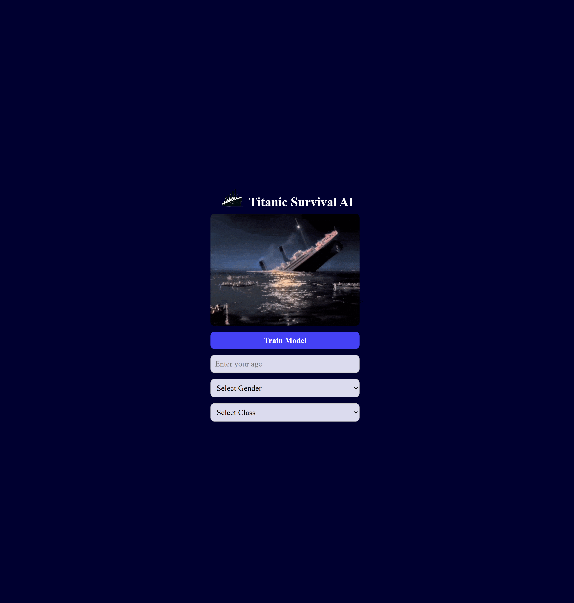

# Titanic Survival Prediction



Titanic Survival Prediction is a beginner-friendly machine learning project built for a machine learning course. The app uses the Titanic dataset to train a simple classification model in the browser and estimates a passenger's survival probability based on user input.

The project reads the raw data from `data/titanic.json`, converts it into model-ready numeric inputs, normalizes the features, builds a TensorFlow.js neural network, trains it for 100 epochs, and then allows the user to make predictions with the trained model.

## Features

- Loads the Titanic dataset from a local JSON file.
- Converts raw data into numeric features.
- Uses age, sex, and passenger class as model inputs.
- Normalizes input values before training and prediction.
- Trains a TensorFlow.js model directly in the browser.
- Uses a sigmoid output layer for binary classification.
- Enables prediction only after training is complete.
- Shows survival probability as a percentage.

## Technologies Used

- HTML5
- CSS3
- JavaScript
- TensorFlow.js

## How It Works

1. The raw Titanic records are loaded from `data/titanic.json`.
2. Relevant fields are selected:
   - `Age`
   - `Sex`
   - `Pclass`
   - `Survived`
3. The categorical `Sex` value is converted to numeric form.
4. The input features are reshaped into a 2D tensor.
5. Age and passenger class values are normalized.
6. A `tf.sequential()` model is created with:
   - A dense hidden layer with ReLU activation
   - A dropout layer to reduce overfitting
   - A second dense hidden layer with ReLU activation
   - A sigmoid output layer for binary prediction
7. The model is compiled with `binaryCrossentropy` loss and the `adam` optimizer.
8. The model is trained for 100 epochs.
9. After training, the prediction form becomes available.
10. The trained model predicts the survival probability for new user inputs.

## Running the Project

Because the project loads `data/titanic.json` using `fetch()`, it should be run from a local web server instead of opening `index.html` directly.

### Option 1: Live Server

1. Open the project folder in VS Code.
2. Start `index.html` with the Live Server extension.
3. Train the model.
4. Enter age, sex, and class values.
5. Click Predict.

## Project Access
- GitHub Pages: `https://Emelinur.github.io/titanic/`

Update the GitHub Pages address after publishing the repository.

## Project Structure

```text
.
├── index.html
├── style.css
├── README.md
├── data/
│   └── titanic.json
└── img
```

## Notes

- This project is intended for learning and experimentation.
- Missing or invalid records are filtered during training.
- The output is a probability, not a guaranteed outcome.

## License

This project was created for educational and portfolio purposes.
